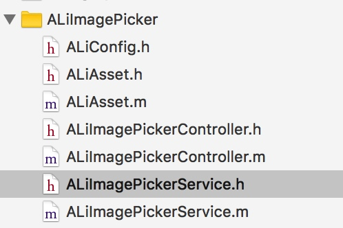
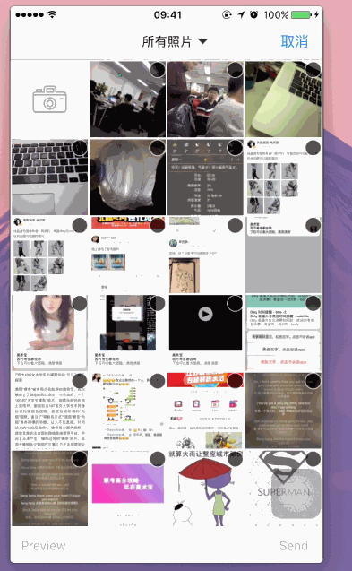

照片选择器

#### 1、目录介绍

* ALiConfig 主要是常用的一些常量的配置
* ALiAsset  相册中每个图片对应的模型 内含系统的PHAsset 同时增加了获取缩略图、预览图、完整 
            图片 以及自定义大小的图片的方法
* ALiImagePickerController 图片选择的控制器 负责展示获取的图片
* ALiImagePickerService 获取图片的一个service，内部封装了一些方法，
                        方便的获取图片以及分类
#### 2、简单介绍
PHAsset是Photos framework中的重要对象，代表iOS中的一个资源（图片、视频）。Photos framework是苹果在iOS8时推出一个Framework，用来取代Assets Library。

而在 iOS8 出现之后，苹果提供了一个名为 PhotoKit 的框架，一个可以让应用更好地与设备照片库对接的框架。

目前根据根据只支持三个版本的规律，相信绝大多数公司都已经最低支持8.0了(如果你在大公司，忽略这里)，所以更换图片选择的库也是必然。

#### 3、效果展示
# 

#### 4、参考文献
[iOS 开发之照片框架详解](http://kayosite.com/ios-development-and-detail-of-photo-framework.html)

[照片框架](https://objccn.io/issue-21-4/)

